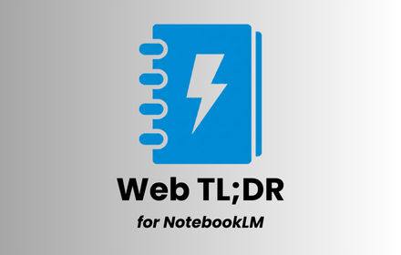

# Web TL;DR for NotebookLM

  

A Chrome extension that seamlessly integrates [Google NotebookLM](https://notebooklm.google.com/) into your browsing workflow. Instantly summarize webpages, specific links, or selected text with a single click.

## Demo

  

  <a href="https://youtu.be/urFhD-QnPug">
     
    Watch Demo Video
  </a>

## Features

- **One-Click Summarization**: Click the extension icon to summarize the current page.
- **Context Menu Integration**:
  - Right-click any page to "Summarize this page".
  - Right-click any link to "Summarize link" (bypassing the need to open it first).
  - Select text, right-click, and choose "Summarize selection" to focus on specific content.
- **Smart Automation**:
  - Automatically opens NotebookLM in a new tab.
  - Imports the target content (URL or selected text).
  - Automatically enters and submits your prompt (default: "TL;DR").
- **Visual Feedback**:
  - **Toast Notifications**: Real-time status updates (Importing, Generating, Success) via a non-intrusive toast.
  - **Tab Title Status**: The NotebookLM tab title updates with emojis (⏳, ✨, ✅) so you can monitor progress from the tab bar.
- **Configurable Options**: Customize your default prompt and behavior.

## Installation

### Developer Mode Installation

1. Download or clone this repository to your local machine.
2. Open Chrome and navigate to `chrome://extensions/`.
3. Enable **"Developer mode"** by toggling the switch in the top-right corner.
4. Click **"Load unpacked"** and select the directory containing the extension files.
5. The extension should now appear in your Chrome toolbar.

## Usage

### Summarize a Webpage

1. Navigate to any webpage.
2. Click the **Web TL;DR** extension icon in the toolbar, OR right-click the page and select **Summarize this page with NotebookLM**.
3. A new tab will open, importing the page and generating the summary.

### Summarize a Link

1. Right-click on any link.
2. Select **Summarize with NotebookLM**.
3. The extension will pass the link to NotebookLM without you needing to visit it first.

### Summarize Selected Text

1. Highlight any text on a webpage.
2. Right-click the selection.
3. Select **Summarize with NotebookLM**.
4. The selected text will be imported as a "Text" source in NotebookLM.

## Configuration

Right-click the extension icon and select **Options** (or click "Extension Options" in `chrome://extensions`) to configure:

- **Custom Prompt**: Change the default "TL;DR" prompt to anything you like (e.g., "Summarize in 3 bullet points").
- **Open in Background**: Toggle whether the NotebookLM tab opens in the background or immediately grabs focus.

## Privacy

This extension:

- **Only** accesses the specific URL or text you explicitly choose to summarize.
- **Does not** collect, store, or transmit any personal data or browsing history to third parties (other than sending the user-initiated URL/Text to Google NotebookLM for processing).
- Runs locally in your browser.

## Requirements

- Google Chrome browser.
- A Google account with access to [NotebookLM](https://notebooklm.google.com/).

## Troubleshooting

- **Login**: Ensure you are logged into Google and can access NotebookLM.
- **Prompt Issues**: If the automatic prompt fails, you can manually type in the NotebookLM chat.
- **Permissions**: Verify the extension has the necessary permissions in `chrome://extensions`.

## License

MIT License. See the [LICENSE](./LICENSE) file for details.
