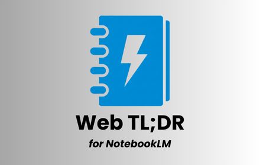
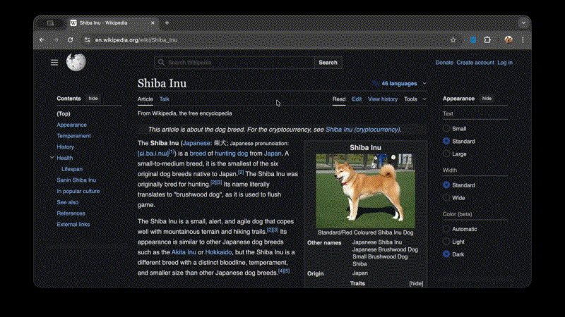

# Web TL;DR for Gemini Notebook

<p align="center">
  
</p>

<p align="center">
  <a href="https://chromewebstore.google.com/detail/web-tldr-for-notebooklm-p/oidbefjbmllmbalkpccifpimlcmcjpkc">
    
  </a>
  
  
  
</p>

A powerful Chrome extension that seamlessly integrates [Gemini Notebook](https://notebook.google.com) into your browsing workflow. Instantly summarize webpages, specific links, or selected text with a single click and smart automation.

---

## 📺 Demo

<p align="center">
  
</p>

<p align="center">
  <a href="https://youtu.be/urFhD-QnPug">
    <br>
    <b>Watch the Full Demo Video</b>
  </a>
</p>

## ✨ Features

- **🚀 One-Click Summarization**: Instantly summarize the current page via the extension icon.
- **🖱️ Context Menu Integration**:
  - Right-click any page to "Summarize this page".
  - Right-click any link to "Summarize link" (no need to open it first).
  - Select text, right-click, and choose "Summarize selection".
- **🤖 Smart Automation**:
  - Automatically opens Gemini Notebook, imports content, and submits your default prompt (e.g., "TL;DR").
- **📢 Visual Feedback**:
  - **Toast Notifications**: Real-time status updates (Importing, Generating, Success).
  - **Dynamic Tab Titles**: Monitor progress via emojis (⏳, ✨, ✅) directly on the tab bar.
- **⚙️ Configurable**: Customize your default prompt and preferred tab focus behavior.
- **🌍 Multilingual**: Support for 8 locales (English, Japanese, Chinese, French, German, Spanish, Portuguese).

## 🛠️ Tech Stack

- **Manifest V3**: The latest Chrome Extension standard.
- **JavaScript (ES6+)**: Core logic and automation.
- **Chrome Extension APIs**: `tabs`, `contextMenus`, `storage`, `runtime`, `i18n`.
- **CSS3**: Modern, non-intrusive toast notifications.

## 📂 Project Structure

```text
.
├── _locales/               # i18n localization files (8 languages)
├── assets/                 # Promotional images and GIFs
├── icons/                  # Extension icons for various sizes
├── background.js           # Background service worker (Context menus)
├── controller.js           # Content script for Gemini Notebook automation
├── manifest.json           # Extension configuration
├── options.html/js         # Settings page
├── PRIVACY.md              # Privacy Policy
└── README.md               # You are here!
```

## 🧠 How it Works

1. **Trigger**: User initiates a summary via icon or context menu.
2. **Transfer**: The extension captures the URL or selected text and opens `notebook.google.com`.
3. **Automation**: `controller.js` waits for the UI to be ready, injects the content, and submits the prompt.
4. **Monitoring**: The extension tracks the generation status and updates the tab title and toast notifications accordingly.

## 💾 Installation

### Chrome Web Store (Recommended)

1. Install from the [Chrome Web Store](https://chromewebstore.google.com/detail/web-tldr-for-notebooklm-p/oidbefjbmllmbalkpccifpimlcmcjpkc).
2. Click **"Add to Chrome"**.

### Developer Mode

1. Clone this repository.
2. Go to `chrome://extensions/` and enable **Developer mode**.
3. Click **Load unpacked** and select this directory.

## 🤝 Contributing

Contributions are welcome! Whether it's a bug report, feature suggestion, or a pull request:

1. **Fork** the repo.
2. **Create** a feature branch (`git checkout -b feature/amazing-feature`).
3. **Commit** your changes (`git commit -m 'feature: add amazing feature'`).
4. **Push** to the branch (`git push origin feature/amazing-feature`).
5. **Open** a Pull Request.

## 🔒 Privacy

We value your privacy. This extension runs locally and **does not** collect, store, or transmit your data to any third parties other than Gemini Notebook itself. See [PRIVACY.md](./PRIVACY.md) for details.

## 📜 License

Distributed under the MIT License. See [LICENSE](./LICENSE) for more information.

---

<p align="center">
  If you find this project useful, please give it a ⭐ to show your support!
</p>
